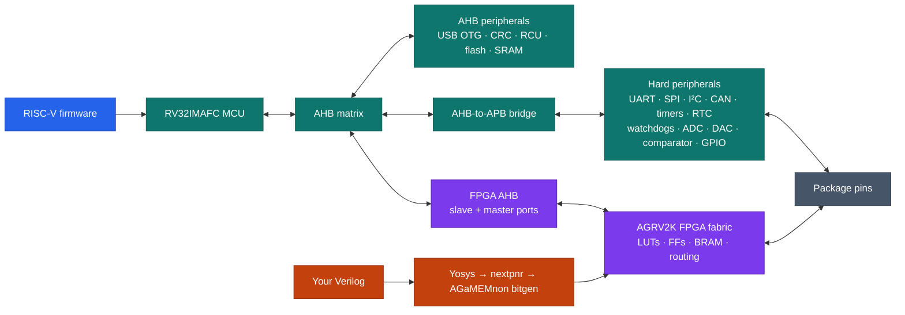

# AGaMEMnon

The [AG32](https://www.agm-micro.com/) is a microcontroller with a small FPGA
bolted to it. It's a real RV32IMAFC core with hard peripherals (UART, SPI, I²C,
CAN, USB, Ethernet MAC, timers, ADC/DAC, GPIO), _plus_ a small programmable
fabric sitting between those peripherals and the pins:
<p align="center">
<table>
<tr>
<th align="left">RISC-V MCU</th>
<th align="left">FPGA fabric</th>
</tr>
<tr valign="top">
<td>
<ul>
<li>RV32IMAFC core, up to 248&nbsp;MHz, hardware FPU</li>
<li>256&nbsp;KB Flash (zero-wait), 128&nbsp;KB SRAM</li>
<li>5&times; UART &middot; 2&times; I²C &middot; SPI</li>
<li>1&times; CAN&nbsp;2.0 &middot; USB&nbsp;FS+OTG &middot; Ethernet MAC</li>
<li>3&times; 12-bit ADC (17&nbsp;ch, 3&nbsp;MSPS) &middot;
2&times; 10-bit DAC</li>
<li>2&times; comparator &middot; RTC &middot; watchdog</li>
<li>basic + advanced timers</li>
</ul>
</td>
<td>
<ul>
<li>2112 LUT4s</li>
<li>2112 flip-flops</li>
<li>4 block RAMs</li>
<li>1 PLL</li>
<li>5 global clocks</li>
<li>architecture advertises up to 128 fabric I/O</li>
</ul>
</td>
</tr>
</table>
</p>

The fabric can be independent logic, a pin-routing layer for hard peripherals,
or a memory-mapped coprocessor beside the MCU. The
[AG32 overview](docs/AG32_OVERVIEW.md) explains the device, naming, clocks,
boot paths, packages, and documentation landscape.

The vendor architecture makes the fabric configurable glue between many hard
peripheral signals and package pads. In principle that permits flexible UART
placement, state machines in signal paths, memory-mapped custom peripherals,
and runtime muxing. AGaMEMnon currently qualifies only the exact routes listed
in the support matrix; a hard-peripheral register driver does not by itself
prove a fabric or package-pin route. It's a bit like a Cypress PSoC, except the
programmable part is an actual FPGA bolted to a RISC-V core.



The AG32 has almost no English-language documentation. The 'normal' way to
build a bitstream is a Windows-only Altera Quartus II fork you fetch from a
Baidu Netdisk link (password `12ej`), driving a black-box fabric back-end,
`af.exe`. There is no Linux path and no open format. Fuck you if you want to
use this chip as intended.

*AGaMEMnon* takes Verilog and produces a flashable AG32 fabric bitstream
— synthesis, pack, place, route, bitstream generation, and programming, with no
vendor binary in the path. It's an SDK for the RISC-V half of this chip. This is
an open toolchain for a weird combination RISC-V microcontroller and FPGA.

This is [IceStorm](https://github.com/YosysHQ/icestorm) for a chip nobody has
heard of. Verilog synthesizes, places, routes, and runs on real silicon:
combinational and sequential logic, counters and state machines, clocking
across the array, output to real pins, and the RISC-V core reading and writing
the fabric over its memory bus. There's a writeup of how it works
[here](http://bbenchoff.com/pages/AGaMEMnon.html).

Watch the video demo:

[![AGaMEMnon video demo][video-thumbnail]][video-demo]

[video-thumbnail]: https://img.youtube.com/vi/udDq3NHxerc/maxresdefault.jpg
[video-demo]: https://www.youtube.com/watch?v=udDq3NHxerc

## Status — and why it had to be done this way

AGaMEMnon has a **supported, evidence-bounded L48 envelope** and fails closed
outside it. The target is the **AG32VF303CCT6 LQFP-48** development board with
`AGRV2KL48` fabric; source installation works today and a downloadable SDK is
in preparation. What is supported — every qualified route and mode, with its
evidence — is [the support matrix](docs/STATUS.md); the silicon record is
[the hardware qualification record](docs/HARDWARE_VALIDATION.md); open work is
in [ROADMAP.md](ROADMAP.md). The rest of this section is *why you can trust
that line*.

### What we started with

At the start there was a chip — a hard RISC-V core with a small FPGA fabric
between its peripherals and its pins — and one way to target the fabric:
`af.exe`, a closed Windows binary from a Baidu link, no Linux path, no open
format, no readable docs for the fabric at all. We had three things: the
binary, a handful of vendor example designs, and a board. The obvious plan —
decompile `af.exe`, extract the tables, reimplement the flow — worked further
than expected. The architecture database was wrapped in a reversible cipher we
recovered; the routing graph reduced to closed-form edge-to-selector mappings,
byte-exact across a quarter-million edges. For large pieces of the problem this
was transcription, not archaeology.

### Where transcription ran out

But transcription gives you the *encoding*, not what is *true on silicon* — and
that gap is the whole project. The vendor's database says what is routable; it
says nothing about what conducts. Some perfectly legal routes are electrically
dead on a real die, and no file tells you which. We looked, five ways, for the
hidden table where `af.exe` knows which edges are good. There is no such table.
The vendor back-end is a conduction-blind congestion router that will happily
route a dead wire; its bitstreams work as a selection effect, because the
designs anyone ever verified were small and local and never leaned on the
marginal edges. So the task was never "recover the vendor's hidden knowledge" —
it has none — but "decide which of a vast space of legal configurations is
actually real," and only the silicon answers that.

### What harvesting and building became

The two verbs shifted. *Harvesting* stopped meaning "extract tables" and became
driving the vendor to *produce* configurations and driving the board to
*reveal* which conduct — the vendor as a witness made to confess each bit's
encoding, the silicon as the only oracle for whether it is worth anything.
*Building* — the open flow that replaces `af.exe` — became "reimplement it and
emit nothing the two harvests have not jointly blessed": gated by evidence, not
by what is encodable. It has to be that strict because the failure is silent. A
wrong bit does not crash; it ships a plausible bitstream that misbehaves on a
chip you cannot see inside, and the user spends a week blaming their own
Verilog. An open toolchain that is subtly wrong is worse than the black box it
replaces, because the black box never had our name on it. Everything below
exists to make that silent-wrong outcome impossible.

### The eight rules that came out of it

- **Silicon is the only oracle.** A claim counts only when a signal has been
  forced through the thing under test and read back on hardware; build success
  and configuration acceptance are not qualification.
- **Witnessed, not predicted.** The tool ships only encodings it has seen the
  vendor actually produce, bit for bit; predictions and decoded-but-unwitnessed
  data live behind `--research-unsafe` and never reach the default surface.
- **Fail closed.** Outside the evidence boundary the tool refuses with a clear
  error rather than emitting something it cannot stand behind — incomplete but
  never wrong.
- **Every claim carries its evidence tier.** Nothing is stated past the tier
  its evidence earned — decoded, differentially validated, statistically
  silicon-validated, or individually qualified — and the tier travels with the
  claim into the [claim policy ledger](docs/CLAIM_POLICY_LEDGER.md).
- **Negatives are evidence, and they are kept.** Failed experiments are
  first-class, hashed, append-only records, and a repeated isolated silicon
  negative outranks any amount of corpus attribution.
- **Make the vendor tool confess.** Build the same design both ways, diff the
  images bit for bit, and let the vendor binary — ground truth — say what each
  configuration bit does.
- **How you measure is part of what you measure.** A characterization method
  can manufacture the very defect it claims to find; a set of "dead" edges
  turned out to be a congestion artifact of the one stressed design that
  catalogued them.
- **Stated certainty is cheap, and here it has been wrong in both directions.**
  Every turning point came from a purpose-built vehicle read on silicon with a
  valid control, not a clever argument — so we make claims a measurement can
  kill, then go build the measurement.

### Why this discipline is necessary

Normal software has a spec to be right against, and a compiler that miscompiles
gets a bug report. A toolchain reverse-engineered from a black box has neither.
There is no datasheet to conform to, no vendor to certify the output, no
authority to appeal to — the chip is the only ground truth, and it does not
talk. Strip away the method and nothing is left underneath a claim but
confidence, and confidence, in this project, has been wrong repeatedly and in
both directions. The epistemology is not a quality process bolted onto the
engineering. It *is* the engineering: the only thing standing between "this
works" and a plausible lie.

That matters more here than for most open tools, because trust is the entire
value proposition. A black box you cannot inspect is still useful — it works.
An open toolchain you cannot trust is neither useful nor honest; it has all the
opacity of the black box and none of the excuse. The one thing AGaMEMnon offers
over `af.exe` is that every claim it makes traces to an electrically observable
fact on real silicon. Take that away and there is no reason for it to exist.

The discipline is also what makes the scale possible. This project generates
far more evidence than any person could read — tens of gigabytes of vendor
builds, image diffs, and silicon traces over a weekend — much of it produced by
machines running largely unattended. That is only safe because the output
self-reduces to a few kilobytes of hash-traced, tier-labeled, independently
reproducible fact, and anything that cannot be reduced that way fails closed
instead of shipping. The byte-exact gates and append-only ledgers are not
ceremony; they are the control system that lets the work happen at a scale no
human can audit by hand.

There is an unexpected payoff in all of it. To trust anything on a chip whose
only ground truth is the silicon, you have to measure the silicon — across
hundreds of purpose-built, self-checking designs run on real hardware,
exercising tens of thousands of distinct routing points, with a statistical
bound on the chance any of it is silently wrong. The larger open
reverse-engineering efforts — IceStorm, Project Trellis, Project X-Ray —
recovered more encoding on bigger parts, but none of them had to do this: on an
ordinary FPGA a legal route conducts, so nobody runs hundreds of designs on
silicon just to check. This one is the exception, which arguably makes it the
only FPGA whose routing has been individually conduction-verified on real
hardware from the outside — because it is the only one whose silicon made that
necessary. A strange distinction for a 2,112-LUT part almost nobody has heard
of: not the largest or the fastest, but quite possibly the most *measured* of
its size ever built.

None of this is free. It makes the tool slower to grow and narrower than it
would be if it simply trusted its own predictions, and it means the honest
answer to "does it do X" is often "not yet, and here is exactly why." That is
the trade, made on purpose: a smaller thing that is true is worth more than a
larger thing that is probably true, because for the person flashing a board
"probably" is indistinguishable from "wrong" until it is too late.

## Quick start

```sh
git clone https://github.com/bbenchoff/AGaMEMnon
cd AGaMEMnon
python3 -m pip install -e ".[programming]"
agamemnon doctor --no-hardware
```

All required data is stored as normal Git objects; Git LFS is not required.

Try it without a board or FPGA toolchain — the repository contains a routed
counter fixture:

```sh
agamemnon verify tests/fixtures/counter_ahb_routed.json --cycles 8
```

Then create and run a first project:

```sh
agamemnon new hello --board ag32vf303-l48    # default template: fabric-free MCU blink
cd hello
agamemnon build                              # MCU-only -> needs just RISC-V GCC
agamemnon run --transport dap                # run on a connected board (volatile SRAM)
```

To exercise the MCU/fabric boundary, use `--template mcu-fpga`. It strictly
replays one immutable, hash-bound L48 route: the default public32 map returns
canonical ID32 `0x4147414d` at offset 0 and zero-extended writable scratch16
at +4, with counter3 at +8 and W1C1 status at +c. The firmware reads and
writes those registers. This exact profile is silicon-qualified; it does not
promote the generic decoded-only `AGAMEMNON_MCU_ENTRY` route option. See
[the register-bank boundary](docs/MCU_AHB_REGISTER_BANK.md).

For the CPU-scale example, `--template serv-blinky` strictly replays the
retained public L48 SERV route and builds its volatile-SRAM loader. The exact
profile is supported; fresh arbitrary SERV/direct-D placement remains
fail-closed. See [the SERV example](examples/serv_blinky/README.md).

Setup comes in tiers, and `agamemnon doctor` reports which one you are at:
Python 3.8+ alone covers inspection, conversion, and offline verification;
the bundled `riscv-none-elf-gcc` (or compatible `riscv64-unknown-elf-gcc`)
adds MCU firmware builds; Yosys and the AGRV2K
nextpnr backend add fabric builds; a CMSIS-DAP probe plus AGaMEMnon's
qualified OpenOCD (`agamemnon install-openocd`) adds programming. See
[Installation](docs/INSTALLATION.md).

## Hardware

The beginner-safe transport is SWD/DAP: it works on an untouched stock board
and can recover one. The USB CDC uploader becomes the convenient application
transport after its loader is installed, and the Pico-driven UART0 mask ROM is
the flash-independent recovery path. Read [Programming](docs/PROGRAMMING.md)
before any persistent write, and compare your board against
[known-good hardware](docs/KNOWN_GOOD_HARDWARE.md) first.

## Documentation

| Read | For |
|---|---|
| [AG32 overview](docs/AG32_OVERVIEW.md) | the device, naming, clocks, boot paths, and vendor sources |
| [Support matrix](docs/STATUS.md) | exactly what is supported and silicon-qualified |
| [Installation](docs/INSTALLATION.md) | toolchains and drivers on Windows, Linux, and macOS |
| [Usage](docs/USAGE.md) | the complete command reference |
| [Projects](docs/PROJECTS.md) | manifests, templates, and the project model |
| [Programming](docs/PROGRAMMING.md) | SWD/DAP, USB CDC, and UART transports and safety flow |
| [Examples](examples/README.md) | runnable RTL, firmware, PCFs, and bitstream recipes |
| [MCU SDK](sdk/README.md) | the open HAL and its qualification state |
| [**MCU HAL reference**](docs/HAL_MCU_REFERENCE.md) | **every MCU-half subsystem: register maps, bitfields, the HAL header that covers it, and each claim's provenance tier** |
| [**FPGA HAL reference**](docs/HAL_FPGA_REFERENCE.md) | **every fabric-half resource: tiles, slices, carry, BRAM, PLL/clocks, IO ring, the config-surface planes, and the bitstream layout** |
| [MCU clocks](docs/MCU_CLOCKS.md) | core versus fabric clocks, transition rules, and current limits |
| [MCU pin routing](docs/MCU_PIN_ROUTING.md) | alternate-function semantics and silicon-backed route policy |
| [Architecture](docs/ARCHITECTURE.md) | the recovered fabric, router, and bitstream internals |
| [Routing admission](docs/ROUTING_ADMISSION.md) | the three-tier default routing model, the confidence manifest, and `--release-strict` |
| [Bitstream format](docs/BITSTREAM_FORMAT.md) | compressed/raw containers, CRC, physical features, and selector policy |
| [MCU External AHB](docs/MCU_AHB_REGISTER_BANK.md) | the qualified constant endpoint and remaining sequential register-bank boundary |
| [Vendor parity](docs/VENDOR_PARITY.md) | the demonstrated, bounded vendor-parity profile and what it does and does not cover |
| [MCU/fabric roadmap](docs/MCU_FABRIC_ROADMAP.md) | unfinished AHB, interrupt, DMA, GPIO, and hard-block work |
| [Hardware qualification](docs/HARDWARE_VALIDATION.md) | the silicon evidence boundary |
| [Claim policy ledger](docs/CLAIM_POLICY_LEDGER.md) | per-feature maturity and evidence tier under the D0 policy, for bitstream-engine features only (generated; not a peripheral or HAL ledger) |
| [Research knowledge profile](docs/ENGINE_CONFIGURATION.md#research-unsafe-recovered-knowledge-profile) | opt-in vendor-derived/conflicted/predicted data and provenance rules |
| [S2 release audit](docs/RELEASE_S2_AUDIT.md) | cold-build, wheel, and example evidence plus the remaining release blockers |
| [Engine refactor](docs/ENGINE_REFACTOR.md) | the executed feature-module engine design and its byte-identity migration record |
| [Qualification reports](docs/QUALIFICATION_REPORT.md) | read-only, reviewable support-evidence intake |
| [Roadmap](ROADMAP.md) | known limitations and prioritized work |
| [Notices](NOTICE.md) | provenance and the licensing boundary |

## Contributing and support

New hardware evidence is especially valuable. Read
[CONTRIBUTING.md](CONTRIBUTING.md) before submitting code or qualification
records, use [SUPPORT.md](SUPPORT.md) when something does not behave as
documented, and report security problems according to
[SECURITY.md](SECURITY.md). User-visible changes are recorded in
[CHANGELOG.md](CHANGELOG.md). Participation is governed by the
[code of conduct](CODE_OF_CONDUCT.md).

## The Name

AGaMEMnon. I had 'AG' to work with, and something about 'MEMory'. I named 
it before Nolan's *Odyssey* came out. I am also mentally preparing for
[Marc Andreessen quoting Aeschylus when Trump finally dies](https://x.com/pmarca/status/1865145956230140134).
