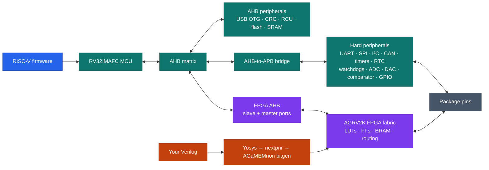

# AGaMEMnon

The [AG32](https://www.agm-micro.com/) is a microcontroller with a small FPGA
bolted to it. It's a real RV32IMAFC core with hard peripherals (UART, SPI, I²C,
CAN, USB, Ethernet MAC, timers, ADC/DAC, GPIO), _plus_ a small programmable
fabric sitting between those peripherals and the pins:
<p align="center">
<table>
<tr>
<th align="left">RISC-V MCU</th>
<th align="left">FPGA fabric</th>
</tr>
<tr valign="top">
<td>
<ul>
<li>RV32IMAFC core @ 248&nbsp;MHz, hardware FPU</li>
<li>256&nbsp;KB Flash (zero-wait), 128&nbsp;KB SRAM</li>
<li>5&times; UART &middot; 2&times; I²C &middot; SPI</li>
<li>1&times; CAN&nbsp;2.0 &middot; USB&nbsp;FS+OTG &middot; Ethernet MAC</li>
<li>3&times; 12-bit ADC (17&nbsp;ch, 3&nbsp;MSPS) &middot;
2&times; 10-bit DAC</li>
<li>2&times; comparator &middot; RTC &middot; watchdog</li>
<li>basic + advanced timers</li>
</ul>
</td>
<td>
<ul>
<li>2112 LUT4s</li>
<li>2112 flip-flops</li>
<li>4 block RAMs</li>
<li>1 PLL</li>
<li>5 global clocks</li>
<li>architecture advertises up to 128 fabric I/O</li>
</ul>
</td>
</tr>
</table>
</p>

The fabric can be independent logic, a pin-routing layer for hard peripherals,
or a memory-mapped coprocessor beside the MCU. The
[AG32 overview](docs/AG32_OVERVIEW.md) explains the device, naming, clocks,
boot paths, packages, and documentation landscape.

The vendor architecture makes the fabric configurable glue between many hard
peripheral signals and package pads. In principle that permits flexible UART
placement, state machines in signal paths, memory-mapped custom peripherals,
and runtime muxing. AGaMEMnon currently qualifies only the exact routes listed
in the support matrix; a hard-peripheral register driver does not by itself
prove a fabric or package-pin route. It's a bit like a Cypress PSoC, except the
programmable part is an actual FPGA bolted to a RISC-V core.



The AG32 has almost no English-language documentation. The 'normal' way to
build a bitstream is a Windows-only Altera Quartus II fork you fetch from a
Baidu Netdisk link (password `12ej`), driving a black-box fabric back-end,
`af.exe`. There is no Linux path and no open format. Fuck you if you want to
use this chip as intended.

*AGaMEMnon* takes Verilog and produces a flashable AG32 fabric bitstream
— synthesis, pack, place, route, bitstream generation, and programming, with no
vendor binary in the path. It's an SDK for the RISC-V half of this chip. This is
an open toolchain for a weird combination RISC-V microcontroller and FPGA.

This is [IceStorm](https://github.com/YosysHQ/icestorm) for a chip nobody has
heard of. Verilog synthesizes, places, routes, and runs on real silicon:
combinational and sequential logic, counters and state machines, clocking
across the array, output to real pins, and the RISC-V core reading and writing
the fabric over its memory bus. There's a writeup of how it works
[here](http://bbenchoff.com/pages/AGaMEMnon.html).

Watch the video demo:

[![AGaMEMnon video demo][video-thumbnail]][video-demo]

[video-thumbnail]: https://img.youtube.com/vi/udDq3NHxerc/maxresdefault.jpg
[video-demo]: https://www.youtube.com/watch?v=udDq3NHxerc

## Status

AGaMEMnon has a **supported, evidence-bounded L48 envelope** and fails closed
outside it. The current hardware target is the **AG32VF303CCT6 LQFP-48
development board** with `AGRV2KL48` fabric. Source installation is available
now; the downloadable SDK is being prepared. L100, L64, and Q32 physical maps
remain unqualified, and unsupported routes, interfaces, frequencies, and
hard-block modes are rejected instead of silently producing an image outside
the evidence boundary. The exact line is drawn in
[the support matrix](docs/STATUS.md) and
[the hardware qualification record](docs/HARDWARE_VALIDATION.md); known gaps
and prioritized work are in [ROADMAP.md](ROADMAP.md).

The MCU/fabric boundary now includes a silicon-qualified External-AHB
register bank subset: one open image integrates an immutable ID byte, a
writable scratch byte, a read-only counter, and one-bit W1C status at
offsets 0/4/8/C, with a qualified GPIO-fed synchronous reset and controlled
single-wait reads. Four independent fabric interrupt sources deliver local
causes 16–19 with a qualified one-hot mask/acknowledge/set command subset,
and x9 BRAM reads are qualified across the exercised address range. Exact
boundaries, exclusions (word-read completion, bursts, byte semantics, hard
reset), and retained hashes are in [the support matrix](docs/STATUS.md) and
[the register-bank boundary](docs/MCU_AHB_REGISTER_BANK.md).

Two structural changes landed in August 2026. The engine core was
restructured into per-feature modules with declared chip-database ownership
and build-time enforcement of each feature's writable image regions; every
retained qualified artifact reproduces byte-identically through the new
engine, verified independently on Linux, Windows, and macOS. And claims now
carry an explicit evidence tier (decoded → differentially validated →
statistically silicon-validated → individually qualified) recorded in
[the claim policy ledger](docs/CLAIM_POLICY_LEDGER.md), which is what lets
the vendor-parity program below scale without weakening the fail-closed
release boundary.

The active work is release hardening: admitting the already-collected routing
coverage, expanding the bounded BRAM/PLL/timing envelope, and reproducing the
wheel, SDK, and examples on clean hosts. Broader packages (Q32/L64/L100), IO
electrical qualification, persistent boot, and vendor-parity breadth continue
as point releases; they do not weaken the first release's fail-closed line.

## Quick start

```sh
git clone https://github.com/bbenchoff/AGaMEMnon
cd AGaMEMnon
python3 -m pip install -e ".[programming]"
agamemnon doctor --no-hardware
```

All required data is stored as normal Git objects; Git LFS is not required.

Try it without a board or FPGA toolchain — the repository contains a routed
counter fixture:

```sh
agamemnon verify tests/fixtures/counter_ahb_routed.json --cycles 8
```

Then create and run a first project:

```sh
agamemnon new hello --board ag32vf303-l48    # default template: fabric-free MCU blink
cd hello
agamemnon build                              # MCU-only -> needs just RISC-V GCC
agamemnon run --transport dap                # run on a connected board (volatile SRAM)
```

To exercise the MCU/fabric boundary, use `--template mcu-fpga`. It strictly
replays one immutable, hash-bound L48 route: offset zero returns ID byte
`0x4d`, and offset four is a writable scratch byte. The firmware reads and
writes both registers. This exact profile is silicon-qualified; it does not
promote the generic decoded-only `AGAMEMNON_MCU_ENTRY` route option. See
[the register-bank boundary](docs/MCU_AHB_REGISTER_BANK.md).

For the CPU-scale example, `--template serv-blinky` strictly replays the
retained public L48 SERV route and builds its volatile-SRAM loader. The exact
profile is supported; fresh arbitrary SERV/direct-D placement remains
fail-closed. See [the SERV example](examples/serv_blinky/README.md).

Setup comes in tiers, and `agamemnon doctor` reports which one you are at:
Python 3.8+ alone covers inspection, conversion, and offline verification;
the bundled `riscv-none-elf-gcc` (or compatible `riscv64-unknown-elf-gcc`)
adds MCU firmware builds; Yosys and the AGRV2K
nextpnr backend add fabric builds; a CMSIS-DAP probe plus AGaMEMnon's
qualified OpenOCD (`agamemnon install-openocd`) adds programming. See
[Installation](docs/INSTALLATION.md).

## Hardware

The beginner-safe transport is SWD/DAP: it works on an untouched stock board
and can recover one. The USB CDC uploader becomes the convenient application
transport after its loader is installed, and the Pico-driven UART0 mask ROM is
the flash-independent recovery path. Read [Programming](docs/PROGRAMMING.md)
before any persistent write, and compare your board against
[known-good hardware](docs/KNOWN_GOOD_HARDWARE.md) first.

## Documentation

| Read | For |
|---|---|
| [AG32 overview](docs/AG32_OVERVIEW.md) | the device, naming, clocks, boot paths, and vendor sources |
| [Support matrix](docs/STATUS.md) | exactly what is supported and silicon-qualified |
| [Installation](docs/INSTALLATION.md) | toolchains and drivers on Windows, Linux, and macOS |
| [Usage](docs/USAGE.md) | the complete command reference |
| [Projects](docs/PROJECTS.md) | manifests, templates, and the project model |
| [Programming](docs/PROGRAMMING.md) | SWD/DAP, USB CDC, and UART transports and safety flow |
| [Examples](examples/README.md) | runnable RTL, firmware, PCFs, and bitstream recipes |
| [MCU SDK](sdk/README.md) | the open HAL and its qualification state |
| [MCU clocks](docs/MCU_CLOCKS.md) | core versus fabric clocks, transition rules, and current limits |
| [MCU pin routing](docs/MCU_PIN_ROUTING.md) | alternate-function semantics and silicon-backed route policy |
| [Architecture](docs/ARCHITECTURE.md) | the recovered fabric, router, and bitstream internals |
| [Bitstream format](docs/BITSTREAM_FORMAT.md) | compressed/raw containers, CRC, physical features, and selector policy |
| [MCU External AHB](docs/MCU_AHB_REGISTER_BANK.md) | the qualified constant endpoint and remaining sequential register-bank boundary |
| [MCU/fabric roadmap](docs/MCU_FABRIC_ROADMAP.md) | unfinished AHB, interrupt, DMA, GPIO, and hard-block work |
| [Hardware qualification](docs/HARDWARE_VALIDATION.md) | the silicon evidence boundary |
| [Claim policy ledger](docs/CLAIM_POLICY_LEDGER.md) | per-feature maturity and evidence tier under the D0 policy |
| [S2 release audit](docs/RELEASE_S2_AUDIT.md) | cold-build, wheel, and example evidence plus the remaining release blockers |
| [Engine refactor](docs/ENGINE_REFACTOR.md) | the executed feature-module engine design and its byte-identity migration record |
| [Qualification reports](docs/QUALIFICATION_REPORT.md) | read-only, reviewable support-evidence intake |
| [Roadmap](ROADMAP.md) | known limitations and prioritized work |
| [Notices](NOTICE.md) | provenance and the licensing boundary |

## Contributing and support

New hardware evidence is especially valuable. Read
[CONTRIBUTING.md](CONTRIBUTING.md) before submitting code or qualification
records, use [SUPPORT.md](SUPPORT.md) when something does not behave as
documented, and report security problems according to
[SECURITY.md](SECURITY.md). User-visible changes are recorded in
[CHANGELOG.md](CHANGELOG.md). Participation is governed by the
[code of conduct](CODE_OF_CONDUCT.md).

## The Name

AGaMEMnon. I had 'AG' to work with, and something about 'MEMory'. I named 
it before Nolan's *Odyssey* came out. I am also mentally preparing for
[Marc Andreessen quoting Aeschylus when Trump finally dies](https://x.com/pmarca/status/1865145956230140134).
