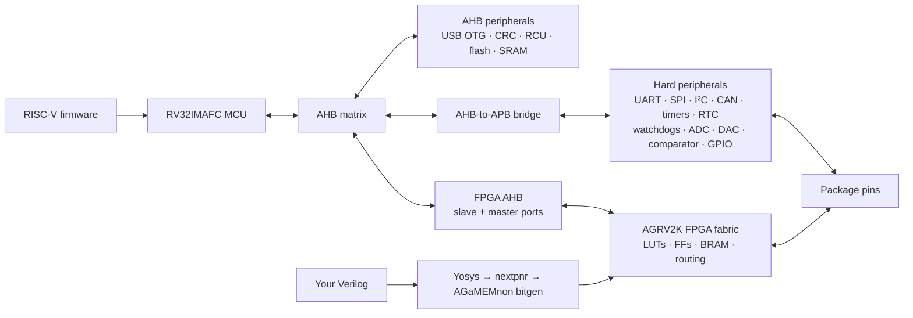

# Introduction to the AG32

The AGM AG32 is a RISC-V microcontroller and a small FPGA in one package. The
MCU runs ordinary firmware and owns hard peripherals; the programmable fabric
can implement independent logic, route peripheral signals, or appear as
memory-mapped hardware beside the CPU.

This page separates the device itself from what AGaMEMnon currently supports.
For exact toolchain claims, use the [support matrix](STATUS.md). For recorded
silicon results, use [hardware qualification](HARDWARE_VALIDATION.md).

## Mental model



The fabric is not a software-configurable GPIO matrix. It is programmable
logic with placement, routing, clocks, and a bitstream. That distinction is
what permits state machines, protocol glue, soft peripherals, custom
memory-mapped registers, and even small soft CPUs.

## Names you will encounter

| Name | Meaning in this repository |
|---|---|
| AG32 | AGM's MCU-plus-programmable-logic product family |
| AG32VF303CCT6 | The LQFP-48 package used in development and testing of this SDK. |
| AGRV2K | The programmable-logic architecture/device family name used by vendor files and AGaMEMnon |
| AGRV2KL48 | The LQFP-48 fabric target used for physical pin routing and current hardware qualification |
| AGaMEMnon | This open SDK, documentation set, FPGA flow, project model, and programmer |

Do not transfer pin numbers or electrical claims between `L48`, `L64`, `L100`,
and `Q32`. AGaMEMnon knows package legality for all four names, but only L48
has the physical bond map and bench evidence needed by the public PCF flow.

## Current reference hardware

The qualified target is the **AG32VF303CCT6 LQFP-48 development board** with
`AGRV2KL48` fabric. The checked-in board definition records:

- 256 KiB main flash and 128 KiB SRAM;
- an 8 MHz HSE input used by the qualified fabric PLL configurations;
- four MCU-visible board LEDs on the vendor-default `GPIO4[1:4]` routes;
- four directly qualified fabric LED pads on package pins 25 through 28;
- DAP, flash-resident USB CDC, and mask-ROM UART transport properties.

The official board page also describes a 50 MHz active FPGA oscillator, an
8 MHz MCU crystal, RTC clocking, buttons, LEDs, flash, USB, and expansion
headers. A board clock being present does not by itself make every clock path
supported by AGaMEMnon.

See the machine-readable
[board definition](../agamemnon/sdk/boards/ag32vf303-l48.toml) and the
[qualification fixture wiring](HARDWARE_VALIDATION.md).

## What the open flow can do

AGaMEMnon's FPGA path is:

```text
Verilog
  -> Yosys technology mapping
  -> nextpnr AGRV2K pack/place/route
  -> AGaMEMnon strict bit generation
  -> volatile SRAM image or compressed flash image
```

The MCU path provides freestanding startup, linker scripts, register headers,
an incremental open HAL, project templates, and RISC-V GCC builds. A project
can contain MCU sources and multiple Verilog sources, with an explicit top
module, PCF, clocks, linker, board, outputs, and flash layout.

Useful starting points:

| Intent | Start with |
|---|---|
| Learn the MCU | `agamemnon new hello --template mcu-blink` |
| Learn the fabric | `agamemnon new hello --template fpga-blink` |
| Connect MCU firmware to custom logic | `agamemnon new hello --template mcu-fpga` |
| Route or create serial logic | `agamemnon new hello --template uart` or `examples/serial_mux/` |
| Inspect every demonstrated peripheral boundary | [Peripheral examples](PERIPHERAL_EXAMPLES.md) |
| Understand the recovered architecture | [Architecture](ARCHITECTURE.md) |

## Boot and programming paths

| Transport | Works on untouched board | Recovery when main flash is bad | Extra hardware |
|---|---|---|---|
| SWD/DAP | Yes, with AGaMEMnon's qualified OpenOCD | Yes | CMSIS-DAP probe |
| Flash-resident USB CDC uploader | No; install it first | No | USB cable only after installation |
| UART0 mask ROM through Pico | The ROM supports it, but the present board harness does not expose every needed signal | Yes | Pico 2 and the documented five-wire board addition |

The AG32 USB connector does not imply a factory USB bootloader. AGaMEMnon's
qualified USB transport is an application installed in main flash. The
flash-independent recovery path discovered so far is the UART0 mask ROM with
`BOOT0=1` and `BOOT1=0`. The hardware half of that path is a Raspberry Pi
Pico 2 running the checked-in
[AG32 UART programmer](../pico/ag32_uart_programmer/README.md) — a fixture
that began as the bring-up logic analyzer and grew into the mask-ROM
programming bridge.

Install and verify the qualified SWD/DAP tool with:

```sh
agamemnon install-openocd
agamemnon doctor --probe-dap
```

Read [Programming](PROGRAMMING.md), [USB CDC uploader](USB_CDC_UPLOADER.md), and
[UART bootloader](UART_BOOTLOADER.md) before writing persistent state.

## Clocks and programmable IO

AGaMEMnon currently accepts fabric `(SYSCLK,HSE)` pairs of `(100,8)`, `(50,8)`,
`(25,8)`, `(10,8)`, and `(100,16)` MHz. This is a qualified list, not the
theoretical capability of the PLL.

Hard-peripheral signals do not automatically appear on arbitrary pins.
Firmware configures the peripheral controller; the loaded fabric must provide
the matching route to package pins. I2C also requires open-drain behavior and
external pull-ups. Check the loaded fabric before assuming a vendor-default
UART, SPI, I2C, USB, or LED route remains present.

## Documentation map

Vendor information is real but fragmented across AGM domains, Chinese-language
pages, downloadable archives, and several naming conventions. These are the
best primary starting points known to this project:

- [AGM AG32 product site](https://www.ag32mcu.com/)
- [AG32 development tools](https://www.ag32mcu.com/dev-tools-category/dev_tools_fpga/)
- [AG32VF303CCT6 development board](https://www.ag32mcu.com/aum-product/products_board_ag32vf303cct6/)
- [AG32 MCU Reference Manual, 2025-05-15 revision](https://www.agm-micro.com/upload/userfiles/files/AG32%20MCU%20Reference%20Manual%2820250515%E4%BF%AE%E8%AE%A2%E7%89%88%EF%BC%89.pdf)
- [AGRV2K data sheet, revision 3.0](https://www.agm-micro.com/upload/userfiles/files/AGRV2K_Rev_3_0.pdf)
- [AG32-Docs source archive and English notes](https://github.com/bbenchoff/AG32-Docs)

AGM's site currently lists AG32 SDK and Supra downloads for Windows and Linux.
That does not make the vendor programmable-logic format open or the complete
workflow easy to reproduce. AGaMEMnon's narrower claim is an inspectable,
testable flow whose supported boundary is recorded in this repository.

## Evidence vocabulary

- **Build supported**: the public strict flow completes without a vendor
  executable or routed vendor checkpoint.
- **Silicon-qualified**: the emitted design was exercised through an
  electrically observable hardware oracle.
- **Vendor-documented**: a primary vendor source describes the feature, but
  AGaMEMnon may not implement or qualify it.
- **Implemented, unqualified**: code or a protocol exists and has software
  tests, but its target-side behavior has not crossed the stated silicon bar.

These labels are deliberately not interchangeable.
